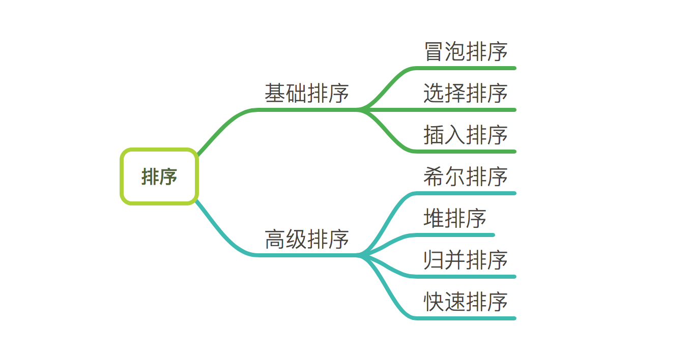

# 排序

## 排序的稳定性

假设(1<=i<=n, 1<=j<=n)，且在排序前的序列中ri领先于rj（即i<j）。如果排序后ri仍领先于rj，则称所用的排序方法是稳定的；反之，若可能使得排序后的序列中rj领先于ri，则称所用的排序方法是不稳定的。

## 内排序和外排序

根据在排序过程中待排序的记录是否全部被放置在内存中，排序分为：内排序和外排序。
内排序是在排序整个过程中，待排序的所有记录全部被放置在内存中。外排序是由于排序的记录个数太多，不能同时放置在内存中，整个排序过程需要在内存之外多次交换数据才能进行。

对于内排序来说，排序算法的性能主要是受3个方面影响：
1. 时间性能
2. 辅助空间
3. 算法的复杂度（算法本身的复杂度，而不是指算法的时间复杂度）

## 常见排序方法分类

